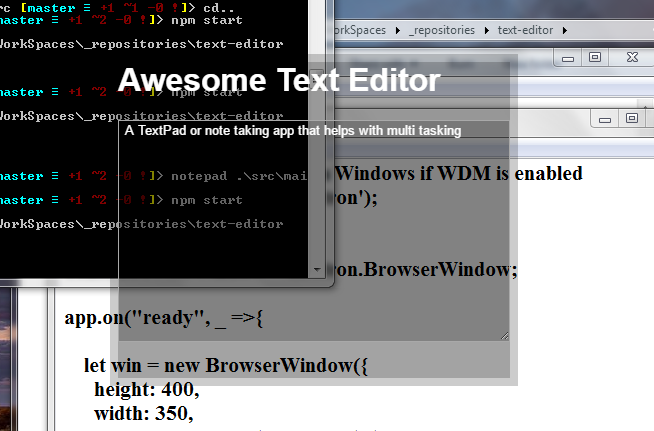

# Text Editor
A text editor based on electron to help with multitasking.

# Installation
Clone the repository and install dependencies and start

  `git clone https://github.com/midhunhk/text-editor.git`  
  `cd text-editor`  
  `npm install`  
  `npm start`
  
# Known Issues
Transparancy won't work on Windows when WDM is disabled
